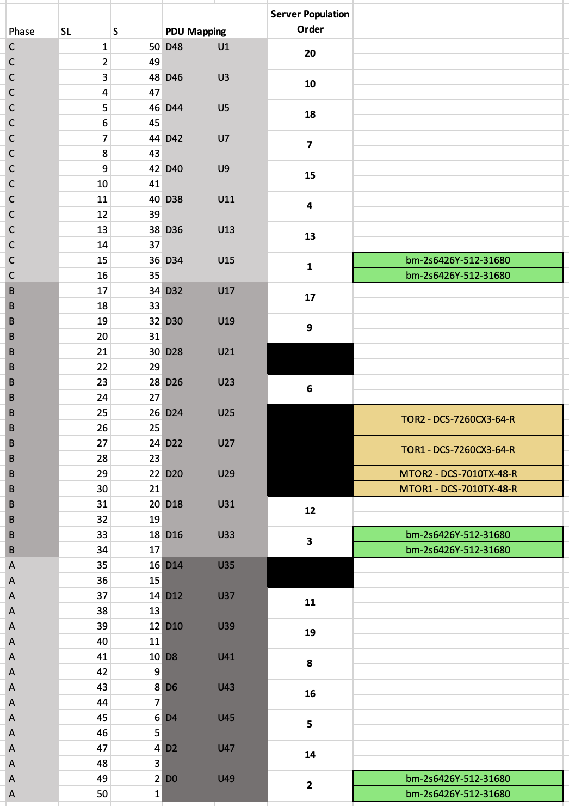

# Elevation Builder

This document provides details for the Elevation Builder utility.

## The Goal

The goal of this tool is to programmatically build elevation files based on a required set of servers for the rack.  This will allow us support many different rack builds dynamically and save time from the team building elevations manually.

Eventually this will be integrated to JiraTasker so you can specify the number of servers you want in a rack while creating the list file.  

## Quick start

Follow these instructions to try out the elevation builder for the first time:

1. Clone the [platform-inventory](https://github.ibm.com/cloudlab/platform-inventory) repo locally
2. Clone the [capacity-analysis](https://github.ibm.com/Zack-Grossbart/capacity-analysis) repo locally
3. Install the Python requirements with these commands:

```
cd ~/work/capacity-analysis
pip3 install -r scripts/requirements.txt
```

Now you're ready to generate an elevation with the following command:

```
python3 scripts/elevation_builder.py NG2 inputs/server_spec.json ~/work/platform-inventory elevation.xlsx elevation.yaml
```

## Background

Elevations specify how to do the physical build of a rack.  They're Excel files that show a representation of the layout of the rack including the position of power phases, switches, and servers.

### How to read elevations

The elevation is a visual depiction of the rack.  If you printed out the elevation and held it next to the rack the servers and switches should be in the same positions in the rack as they are in the elevation.



The `SL` number shows the SoftLayer slot number which starts at the top and goes down to the bottom.

The `S` or `U` number starts at the bottom and goes to the top.  This number is the industry standard.

This means that if you were standing in front of the rack power phase A would be closer to the floor and power phase C would be closer to the ceiling.

## Server specification and running the tool

The main input to this tool is the server specification JSON file.  A sample of this file looks like this:

```json
{
    "rackClass": "compute_ng3_1u_2u_mix_bm_s01_s50_7010tx-48_pdu_down",
    "servers": {
        "bm-2s8474C-2048-62400": 5,
        "bm-2s6426Y-512-31680": 10
    }
}
```

`rackClass` specifies the class to use for this rack.  The rack class must be a qualified rack configuration with a YAML file of the same name with the `.yaml` extension that's in the [specifications/racks](https://github.ibm.com/cloudlab/platform-inventory/tree/master/specifications/racks) directory in the `platform-inventory` repository.

`servers` specifies the servers to add to the rack elevation.  The key of this object is the class for the server and the value is the number of the servers of that type you want in the elevation.  The server classes must be qualified classes with a YAML file of the same name with the `.yaml` extension in the [specifications/solutions](https://github.ibm.com/cloudlab/platform-inventory/tree/master/specifications/solutions) directory of the `platform-inventory` repository or one of the child directories.

The servers classes must be allowed by the rack specification and the number of servers must be supported in the slots specified in the rack specification.  

Once you've specified the server specification you can run the tool with a command like this:

```
python3 scripts/elevation_builder.py NG2 server_spec.json ~/work/platform-inventory elevation.xlsx elevation.yaml
```

### PDU up vs. down

The rack class indicates if the rack is PDU up or down.  That indicates if the power cables for the room come from the ceiling or the floor.  Right now the up and down rack specifications are the same from an elevation point of view.  

**You can choose either option**

In this case you can choose either rack specification when running the tool.

### Arguments

| Position | Notes |
|---|---|
| 1 | The elevation template to use.  Allowed values are `BareMetal`, `NG2`, and `NG3`.  I may remove this argument since I'm not sure I need it. |
| 2 | The path to the server specification JSON file. |
| 3 | The path to a local copy of the `platform-inventory` repository. |
| 4 | The output path to generate the elevation. |
| 5 | The output path to generate the YAML file describing the server allocations. |

## How to build an elevation

This uses the following general rules for building an elevation:

1. Try to load all three power phases equally
1. Place servers that take more power and weigh more closer to the bottom of the rack
1. Only place servers in allowed positions based on the rack specification

## Status of this tool

This tools is working well, but is still an early version.  All elevations generated by this tool must be validated by one of the following people before they can be built in a data center:


| Name | Slack ID | 
|---|---|
| Amilcar Arvelo | @Amilcar Arvelo  |
| Eric Mckeever | @Eric |
| Felipe Telles | @Felipe Telles |

### Caveats

The big caveat of this tool is that it will generate elevations that are allowed by the qualified rack classes.  That doesn't mean the elevation is actually valid.  The easiest example of this is that many rack specifications are flexible enough that you can add too many servers for the rack.  You must validate the elevation before building a rack in a data center.