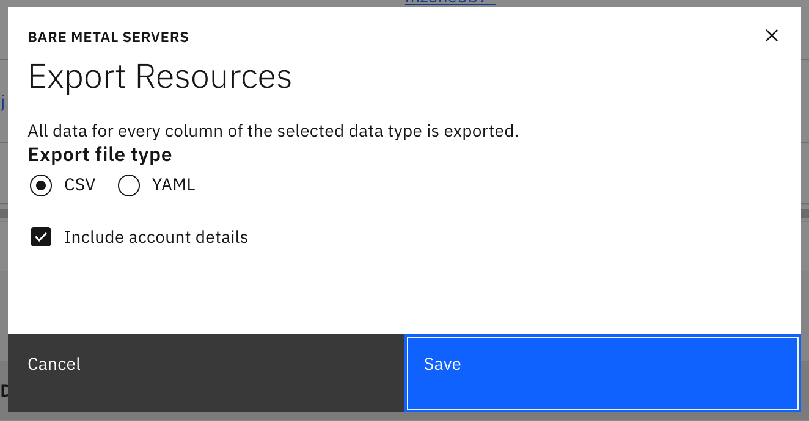

# Zyphra Usage Report

The Zyphra usage reports shows the current usage of the Zyphra cluster.  It will gather the data about in use and reserve pool servers and put it in one easy place to review.  The output looks like this:

```
Zyphra Cluster Report - ⬤

    In Use:          128
    Available:         2
    Stopped:           0
    Qualifying:        5
    Maintenance:       0
    Tainted:           4
    Other:             0
    ----------------------------
    Total:           139


Tainted Nodes
Host Name                Taint Reason          Jira       Status          Days Open
wdc3-qz1-sr5-rk491-s12   NoScheduleServer      SYS-40477  Vendor Support  1
wdc3-qz1-sr5-rk490-s12   NoScheduleServer      SYS-40491  Vendor Support  0
wdc3-qz1-sr4-rk461-s20   NoScheduleServer      SYS-40492  Vendor Support  0
wdc3-qz1-sr5-rk465-s20   NoScheduleServer      SYS-40493  Vendor Support  0
```

## Prerequisites

You must have an API key and email for Jira.  Export the following environment variables:

| Name | Notes |
|---|---|
| JIRA_TOKEN | Your API token to access our Jira server.  You can generate a token in the [Security](https://id.atlassian.com/manage-profile/security) page of your Jira account settings. |
| JIRA_EMAIL | The email address of your account to access Jira. |

You must also download the `Bare Metal Servers` and the `Bare Metal Server Nodes` CSV files from the [Operations Dashboard](https://opsdashboard.w3.cloud.ibm.com/ops/baremetalservers) and place them in a directory named `output`.  The script will automatically look for the ones named with the current date.

Make sure to select the `Include account details` checkbox when exporting the Bare Metal servers.



## Running the report

The report is run with a single command:

```
python3 scripts/generate_zyphra_usage.py
```

There are no arguments needed.  The command will combine the data from the CSV files and from Jira to generate the report shown above.

## Understanding the report

This report tries to give a view of the cluster in a useful way for cluster management.  It shows servers in the following states:

| State | Notes |
|---|---|
| In Use | The count of servers that are in use in the Zyphra cluster right now.  This will count the 2 hot spares as well.  This number should be 128 when everything is healthy. | 
| Zyphra Stopped | The servers that are stopped in the Zyphra account.  This should include the two host spares as well as any servers that they have stopped for other reasons. |
| Available | The servers that are available in the spare pool.  These servers have been deleted from an account.  This number should be at least 4 which makes 6 servers available (including the 2 hot spares) | 
| Stopped | Servers that are stopped and not in the Zyphra account. | 
| Qualifying | Servers that have been returned from a hardware repair and are being qualified as good by IBM before they go into the available pool.  This is the count of all running servers that aren't used by Zyphra.  | 
| Fixing | A server that's currently getting fixed by the hardware repair team or Dell.  These are all servers running that are not in the Zyphra account which have a Jira ticket in the `SMC Support` state. |
| Maintenance | Servers that are in `Maintenance` mode.  This normally means the server is being diagnosed or repaired.  To move a server out of `Maintenance` mode you must do an ECR or an INC following the [Exiting Maintenance Mode](https://pages.github.ibm.com/cloudlab/internal-docs/bare_metal_server_maintenance_mode.html#exiting-maintenance-mode) run book. | 
| Tainted | Servers that are tainted.  This typically means there was an issue during the reclaim process and these servers need additional investigation or repair.  Once a server repair is completed we must create an INC or ECR to follow the [Re-running the reclaim](https://pages.github.ibm.com/cloudlab/internal-docs/bare_metal_server_reclaim_failed.html#re-running-the-reclaim) run book.  [INC9633275](https://watson.service-now.com/now/nav/ui/classic/params/target/incident.do%3Fsysparm_query%3Dnumber%3DINC9633275) is an example. | 
| Other | Servers in all other states.  They will show up in a special table to show more of the details server. | 
