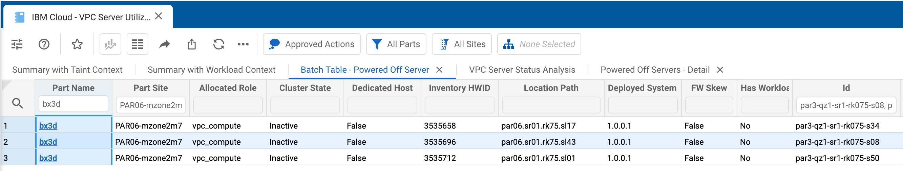

# Kinaxis Use Case - Tracking Removed Servers as Capacity

As part of [SYS-28885: [EXISTING] Remove / Convert Hosts in PAR06 (par3)](https://jiracloud.swg.usma.ibm.com:8443/browse/SYS-28885) we convert three servers in PAR06 from the `bx3d` class to the `gx3-l40s-pcie` class by adding L40s GPU cards to them.  As part of that we also removed three servers from the mzone configuration so we wouldn't bump over the power cap:

* `par3-qz1-sr1-rk075-s08` - [SL01N6T1](https://internal.softlayer.com/Hardware/view/3535696)
* `par3-qz1-sr1-rk075-s34` - [SL01N6SC](https://internal.softlayer.com/Hardware/view/3535658)
* `par3-qz1-sr1-rk075-s50` - [SL01N6SS](https://internal.softlayer.com/Hardware/view/3535712)

This change was made in PR [#30400](https://github.ibm.com/cloudlab/platform-inventory/pull/30400).

Those three servers will be left in the racks, but powered down.  They're all fully functional `bx3d` servers.  They're all leased assets so they can't be moved to a different region unless we break the lease.

## Use case

This section outlines the specific use case for managing this capacity.

### Goals

The goals of this use case are:

* Get clear visibility into what capacity is available
* Improve VPC capacity management efficiency
* Ensure that servers in this state are never _lost_ in the system

## User experience

Without Kinaxis this would be tracked in spreadsheets and would require manual filtering and searching to ensure these servers were properly reported and used.  [Kinaxis](https://na2.kinaxis.net/web/IBCP02_PRD01/saml2) makes this easy to track with the `VPC Server Utilization & Take Rate` workbook.  

This workbook shows a `Summary Taint with Context` which makes it easy to see the total number of powered off servers.  On 05-AUG-2024 that number was 1,885.  You can then easily drill in and view the powered off servers by location with a view like this:

## Additional improvements

* It would be useful to see the lease state of the server in this view since that indicates if the server can be cross shipped to a different region.