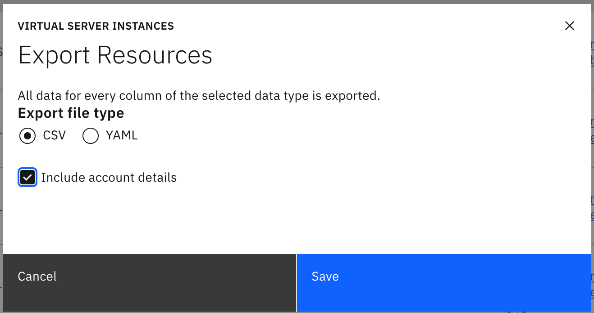

# VPC Capacity Analysis Scripts

This repository contains useful scripts for analyzing the fleet and capacity of VPC.  

The [Capacity Analysis Usage Reports](usage_reports.md) page contains more information about the usage reports and how to generate them.

## Prerequisites

The best way to run these scripts is to clone the repository locally using GitHub Desktop or the Git command line.  

You must also install `python3` locally if you don't already have it.  If you're on a Mac you can install `python3` with a package manager like [Homebrew](https://brew.sh/).

Then you can us `pip3` to install the Python dependencies with a command like this:

```
pip3 install -r scripts/requirements.py
```

After that you're ready to run these scripts.

## `count_inventory_state.py`

This script will count the inventory states from the [`platform-inventory`](https://github.ibm.com/cloudlab/platform-inventory) repository.  You must clone a local copy of the repository before running this script.

Then run a command like this:

```
python3 count_inventory_state.py /Users/zackgrossbart/work/platform-inventory
```

The output will be a table in Markdown format with the information like this:

```
| State Name | State Count | Notes |
|---|---|---|
| `racking` | 1143 | |
| `production` | 23722 | |
| `open` | 2863 | |
| `configuration` | 2787 | |
| `plan` | 952 | |
| `unknown` | 199 | |
| `decommission` | 2184 | |
```

## `count_node_roles.py`

This script will count the node roles from the [`platform-inventory`](https://github.ibm.com/cloudlab/platform-inventory) repository.  You must clone a local copy of the repository before running this script.

Then run a command like this:

```
python3 count_node_roles.py /Users/zackgrossbart/work/platform-inventory role_desc.csv
```

The output will be a table in Markdown format with the information like this:

```
| Node Role | Count | Notes |
|---|---|---|
| `compute` | 58 |  |
| `cos_accesser` | 8 |  |
| `cos_extra_storage` | 3 |  |
| `cos_kafka` | 5 |  |
| `cos_regular_storage` | 4 |  |
| `cos_slicestor` | 24 |  |
| `custom` | 2,873 | Indicates that the node is a custom configuration or _frakenbuild_.  These nodes are often purchased for experiments or potential new projects. |
| `k8_master` | 19 |  |
| `k8_worker` | 18 |  |
```

## `find_host_by_vsi.py`

This script will quickly find the host that the specified VSI sits on.  You can specify the VSI by ID or name.

Start by going to the [VSI Instances](https://opsdashboard.w3.cloud.ibm.com/ops/instances) page in the Ops Dashboard and downloading the CSV of all of the instances.

Then run the script with a command like this to find the host information for a VSI named `kube-ci5hbm6w0fljlek612ig-watsonxprod-workerp-00022614`:

```
python3 find_host_by_vsi.py Instances-20240719.csv kube-ci5hbm6w0fljlek612ig-watsonxprod-workerp-00022614
```

The output will be `wdc3-qz1-sr3-rk006-s30`

## `find_host_field.py`

This script will quickly find the specified field for the specified host.  

Start by going to the [Host Nodes](https://opsdashboard.w3.cloud.ibm.com/ops/hosts) page in the Ops Dashboard and downloading the CSV of all of the hosts.

Then run the script with a command like this to get the `kernelVersion` of `wdc3-qz1-sr3-rk006-s30`:

```
python3 find_host_field.py Hosts-20240719.csv wdc3-qz1-sr3-rk006-s30 kernelVersion
```

The output will be the value of the field like: `5.15.0-1041-ibm-gt`.

## `find_host_field_by_instance.py`

This script will find the value of the specified field in the host that the specified instance is running on.

Start by going to the [VSI Instances](https://opsdashboard.w3.cloud.ibm.com/ops/instances) page in the Ops Dashboard and downloading the CSV of all of the instances.  You can also download for a specific mzone [like this](https://opsdashboard.w3.cloud.ibm.com/ops/?deploymentZone=mzone777) if you know where you're VSI is.

Then go to the [Host Nodes](https://opsdashboard.w3.cloud.ibm.com/ops/hosts) page in the Ops Dashboard and downloading the CSV of all of the hosts.

Then you can find the `kernelVersion` of the host running the VSI `kube-ci5hbm6w0fljlek612ig-watsonxprod-workerp-00022614` with a command like this:

```
python3 find_host_field_by_instance.py Instances-20240719.csv Hosts-20240719.csv kube-ci5hbm6w0fljlek612ig-watsonxprod-workerp-00022614 kernelVersion
```

The output will show the name of the initial ID, the host, and the value of the specified field like this:

```
kube-ci5hbm6w0fljlek612ig-watsonxprod-workerp-00022614: wdc3-qz1-sr3-rk006-s30: 5.15.0-1041-ibm-gt
```

## `generate_watsonx_usage.py`

This is a specialized script that will show all GPU instances in use by the Watsonx team.  The Watsonx team provisions exclusively through ROKS so this script will determine the account used to do the provisioning through ROKS and detect if they're any of the Watsonx accounts.

This script looks for GPU VSIs in the following well-known Watsonx Accounts:

```
WML Production Account (Includes WD, LON and TOK)
ID: c0c058086b74f148f0bf644b83072ae6

WML-frankfurt-YP (Production)
ID: 349a0e2c66424700830e3fbe30983d06

WML YPQA-YPCR
ID: b399407b07d54934a8a07266f5b191d0

WML_YS1
ID: dbf4768b7c74e43d64165e2d73108b88
```

Start by going to the [VSI Instances](https://opsdashboard.w3.cloud.ibm.com/ops/instances) page in the Ops Dashboard and downloading the CSV of all of the instances.

Make sure to select the `Include account details` checkbox in the download dialog.



Then you can generate the report with a command like this:

```
python3 generate_watsonx_usage.py Instances-20240719.csv watsonx_usage.csv
```

It will generate a CSV file at the specified path with information about just the GPU usage.  That CSV file looks like this:

| Region | Server Type | Total Servers |
|---|---|---|
| `us-east` | `8xa100` | 40 |
| `us-east` | `2xa100` | 56 |
| `us-east` | `l40s` | 25 |
| `jp-tok` | `l40s` | 10 |
| `eu-de` | `l40s` | 10 |
| `eu-de` | `8xa100` | 6 |
| `eu-gb` | `2xa100` | 18 |
| `eu-gb` | `8xa100` | 4 |
| `us-east` | `l4s` | 38 |
| `eu-de` | `l4s` | 6 |
| `eu-de` | `2xa100` | 20 |
| `jp-tok` | `l4s` | 9 |
| `jp-tok` | `8xa100` | 6 |
| `eu-gb` | `l4s` | 10 |
| `jp-tok` | `2xa100` | 28 |
| `eu-gb` | `l40s` | 10 |


This indicates that the Watsonx team is currently using 40 `8xa100` servers, 45 `2xa100` servers, and 25 `L40s` servers in the `us-east` region.

This script will only list the following GPU types:  `8xa100`, `2xa100`, `l40s`, `l4`, and both `h100` profiles.

This script makes the following assumptions:

* The Watsonx team does all of their provisioning through ROKS (this has been confirmed with Paul Van Run on the Watsonx team)
* The Watsonx team does all of their provisioning through the four accounts listed above (also confirmed with Paul Van Run
* GPU profiles take an entire server so there's a 1-1 relationship between VSIs and node usage.

We upload the output of this script to Box: [here](https://ibm.ent.box.com/file/1600718089547)


## `generate_external_gpu_usage.py`

This is a specialized script that show the usage of GPU types with a breakdown of internal vs. external usage.  For this script external means directly provisioned by a customer.  If a customer provisions through ROKS then we consider this internal usage.

Start by going to the [VSI Instances](https://opsdashboard.w3.cloud.ibm.com/ops/instances) page in the OPs Dashboard and downloading the CSV of all of the instances.

Then go to the [VSI Instances](https://opsdashboard.w3.cloud.ibm.com/ops/hosts) page in the OPs Dashboard and download the CSV of all of the hosts.

Then you can generate the report with a command like this:

```
python3 scripts/generate_external_gpu_usage.py output/Instances-20241010.csv output/Hosts-20241010.csv output/internal-external-gpu-usage-2.csv
```

It will generate a CSV file at the specified path with the same information about just the GPU usage.  

## `generate_reports.py`

This is a helper script that generates the Watsonx usage and internal/external GPU usage report in a single command.

Start by going to the [VSI Instances](https://opsdashboard.w3.cloud.ibm.com/ops/instances) page in the OPs Dashboard and downloading the CSV of all of the instances.

Then go to the [VSI Instances](https://opsdashboard.w3.cloud.ibm.com/ops/hosts) page in the OPs Dashboard and download the CSV of all of the hosts.

Please both files in a directory named `output`.

Then run this command:

```
python3 scripts/generate_reports.py
```

The script will look for the hosts and instances CSV file for the current day and then generate both reports in a single command.  The reports will be generated in the same `output` directory.


## `find_available_host.py`

This script will quickly find available hosts that match a specific profile.  Available means that the host is untainted, powered on, has zero instances, and a status of `Normal` instead of `Inactive`.

Start by going to the [VSI Instances](https://opsdashboard.w3.cloud.ibm.com/ops/instances) page in the Ops Dashboard and downloading the CSV of all of the instances.

Then run the script with a command like this to find all available hosts with `gx2-a100` in their profile:

```
python3 scripts/find_available_host.py output/Hosts-20240814-777.csv gx2-a100
```

The output will be a list of the available host names like this:

```
wdc3-qz1-sr3-rk085-s34
wdc3-qz1-sr3-rk087-s16
wdc3-qz1-sr3-rk047-s16
wdc3-qz1-sr3-rk007-s34
wdc3-qz1-sr3-rk205-s34
Available host count: 5
```

...or nothing and a count of zero if there were no available hosts with that profile.

## `cpu_breakdown.py`

This script takes a CSV file containing a list of servers from a DB2 query, consolidates the servers into useful categories, and prints out a CSV file with the counts suitable for creating a pie chart.

You must have access to the DB2 database that mirrors Cognos so you can get access to this data.  Once you do you can access the list of servers with a SQL query like:

```sql
SELECT *
FROM LANDING.HARDWARE_SOURCE t1
         left join landing.VPC_IMS_ACCOUNT_ID t2 on t1.IMS_ACCOUNT_ID = t2.IMS_ACCOUNT_ID
WHERE DATE = '8/12/2024'
  and t2.IMS_ACCOUNT_ID is null
  and hardware_type = 'Server'
  and ((lower(HARDWARE_STATUS_REASON) like '%nextgen%' or lower(HARDWARE_STATUS_REASON) like '%vpc%' or
        lower(HARDWARE_STATUS_REASON) like '%genesis%')
    or (lower(LAST_HARDWARE_NOTE) like '%nextgen%' or lower(LAST_HARDWARE_NOTE) like '%vpc%' or
        lower(LAST_HARDWARE_NOTE) like '%genesis%'))
    
```    

Then run the script with a command like this to summarize the servers:

```
python3 scripts/cpu_breakdown.py output/not_in_vpc_account.csv
```

The output will be a CSV file with the summary like this:

```csv
PROCESSOR_DESCRIPTION,count
Liquidation,1164
Sapphire-Rapids for VSI,2383
Missing Parts,277
Cascade-Lake - Likely usable,1631
Skylake,280
Cascade-Lake,878
Uknown CPU type,622
EPYC-7763-2.45GHz,28
Spare,145
Broadwell,135
Sapphire-Rapids for Bare Metal,55
EPYC-7642-2.3GHz,17
Sapphire-Rapids for SAP,3
Icelake,4
XEON-E-2174G-QuadCore-CoffeeLake,1
Haswell,2
```

The output includes specialized categories for `Liquidation`, `Sapphire-Rapids` and `Cascade-Lake`.  

### Liquidation

The `Liquidation` category are any servers with a `HARDWARE_STATUS` of `Liquidation`, `Liquidate_Prep`, or `Retired`.

### Sapphire-Rapids

| CPU Type | Notes |
|---|---|
| `XEON-8474C-Sapphire-Rapids` | Usable for VSI capacity in VPC |
| `XEON-6426Y-Sapphire-Rapids` | Usable for bare metal capacity |
| `XEON-8490H-Sapphire-Rapids` | Usable for SAP |

### Cascade-Lake

Cascade lake servers are separated into two categories: `Cascade-Lake` and `Cascade-Lake - Likely usable`.  The `Cascade-Lake - Likely usable` are all servers that meet the following criteria:

* The processor description contains `Cascade-Lake`
* The `HARDWARE_STATUS` is not `Missing_Parts`, `Spare`, `Hardfail`, or `Quarantine`.
* The `MOTHERBOARD_MODEL` is `X11QPH+_R1.20`, `X11DPU+_R1.10`, or `X11QPH+_R1.01`
* The `CHASSIS_SIZE` is `2`

All other Cascade-Lake that don't fit this criteria are in the `Cascade-Lake` category.

## `dc_breakdown.py`

This script takes a CSV file containing a list of servers from a DB2 query and breaks them down by data center with a count for each.

You must have access to the DB2 database that mirrors Cognos so you can get access to this data.  Once you do you can access the list of servers with a SQL query like:

```sql
SELECT *
FROM LANDING.HARDWARE_SOURCE t1
         left join landing.VPC_IMS_ACCOUNT_ID t2 on t1.IMS_ACCOUNT_ID = t2.IMS_ACCOUNT_ID
WHERE DATE = '8/12/2024'
  and t2.IMS_ACCOUNT_ID is null
  and hardware_type = 'Server'
  and ((lower(HARDWARE_STATUS_REASON) like '%nextgen%' or lower(HARDWARE_STATUS_REASON) like '%vpc%' or
        lower(HARDWARE_STATUS_REASON) like '%genesis%')
    or (lower(LAST_HARDWARE_NOTE) like '%nextgen%' or lower(LAST_HARDWARE_NOTE) like '%vpc%' or
        lower(LAST_HARDWARE_NOTE) like '%genesis%'))
    
```    

Then run the script with a command like this to summarize the servers:

```
python3 scripts/dc_breakdown.py output/not_in_vpc_account.csv
```

The output will be a CSV file with the summary like this:

```csv
DATACENTER,count
Not Applicable,97
MON04,212
DAL07,584
SAO01,66
MAD04,20
WDC06,639
POK01,482
DAL12,565
TOR05,253
WDC04,462
DAL10,1180
LON04,60
FRA04,370
DAL13,433
```

## `dc_breakdown_by_cpu.py`

This script takes a CSV file containing a list of servers from a DB2 query and breaks them down by data center with labels and a count for each label.

You must have access to the DB2 database that mirrors Cognos so you can get access to this data.  Once you do you can access the list of servers with a SQL query from the [Capacity Analysis Queries](../docs/queries.md).

Then run the script with a command like this to summarize the servers:

```
python3 scripts/dc_breakdown_by_cpu.py output/not_in_vpc_account.csv out.csv
```

The output will be a CSV file at the output path with contents like this:

```csv
Datacenter,Total,Dell - Too old to use,Uknown CPU type - missing parts,Cascade-Lake - Not suitable for production,Cascade-Lake - Potential for production,POK - Development,IBM Z Processor,Liquidation,Austin,Sapphire-Rapids for VSI,Sapphire-Rapids for Bare Metal,XEON-E3-1270-V6-QuadCore-KabyLake,Missing Parts,Icelake,Haswell,XEON-E-2174G-QuadCore-CoffeeLake,EPYC-7763-2.45GHz,Spare,XEON-6438N-Sapphire-Rapids
AUS01,49,,,,,,,,49,,,,,,,,,,
DAL07,28,,6,,2,,,,,1,19,,,,,,,,
DAL09,307,,,64,86,,,16,,119,19,,3,,,,,,
DAL10,399,22,10,71,37,,1,26,,204,22,2,2,,,2,,,
DAL12,216,18,85,25,60,,1,17,,2,,,4,,,,,,4
DAL13,1150,802,138,34,106,,,34,,27,4,3,2,,,,,,
```

## `find_x_in_y.py`

This script will find all of the lines from a given file that exist in a second file.  This is very useful when trying to identify which hosts from a list belong in a second list.

For example, if I was having an issue with a set of hosts I might have a list of all hosts with the issue like this:

```
wdc3-qz1-sr3-rk002-s30
wdc3-qz1-sr3-rk004-s04
wdc3-qz1-sr3-rk006-s04
wdc3-qz1-sr3-rk006-s42
wdc3-qz1-sr4-rk112-s20
wdc3-qz1-sr3-rk007-s42
wdc3-qz1-sr3-rk008-s04
wdc3-qz1-sr3-rk009-s30
wdc3-qz1-sr3-rk009-s42
wdc3-qz1-sr4-rk147-s12
wdc3-qz1-sr3-rk010-s30
wdc3-qz1-sr3-rk010-s42
```

If I wanted to know which of the hosts on that list were H100 hosts I could create a second list of all H100 hosts like this:

```
wdc3-qz1-sr4-rk105-s34
wdc3-qz1-sr4-rk106-s12
wdc3-qz1-sr4-rk106-s20
wdc3-qz1-sr4-rk106-s34
wdc3-qz1-sr4-rk108-s12
wdc3-qz1-sr4-rk108-s20
wdc3-qz1-sr4-rk108-s34
wdc3-qz1-sr4-rk112-s12
wdc3-qz1-sr4-rk112-s20
wdc3-qz1-sr4-rk112-s34
wdc3-qz1-sr4-rk117-s12
wdc3-qz1-sr4-rk117-s20
wdc3-qz1-sr4-rk141-s12
wdc3-qz1-sr4-rk141-s20
wdc3-qz1-sr4-rk145-s12
wdc3-qz1-sr4-rk145-s20
wdc3-qz1-sr4-rk145-s34
wdc3-qz1-sr4-rk147-s12
wdc3-qz1-sr4-rk147-s20
wdc3-qz1-sr4-rk147-s34
wdc3-qz1-sr4-rk165-s12
```

Save these lists as files with names like `hosts_with_issue.txt` and `all_h100s.txt`.  Then run the following command:

```
python3 scripts/find_x_in_y.py hosts_with_issue.txt all_h100s.txt
```

The output will show all lines from the first file that appear in the second file.  Like this:

```
wdc3-qz1-sr4-rk112-s20
wdc3-qz1-sr4-rk147-s12
```

## `find_instances_for_hosts.py`

This script takes a CSV file containing a list of Instances and a text file containg a list of hosts and finds all of the instances for those hosts.

Start by going to the [VSI Instances](https://opsdashboard.w3.cloud.ibm.com/ops/instances) page in the Ops Dashboard and downloading the CSV of all of the instances.

Then create a file with the hosts you're interested in like this:

```
dal1-qz1-sr6-rk122-s12
dal1-qz1-sr6-rk122-s99
dal2-qz1-sr2-rk496-s48
```

Then you can run this script with the following command

```
python3 scripts/find_instances_for_hosts.py Instances-20241008.csv hosts.txt
```

It will find all of the instances on those three hosts and print them like this:

```
dal1-qz1-sr6-rk122-s12 - rias-datap-vsi1-l2wwtmxy
dal1-qz1-sr6-rk122-s99 - No instances found
dal2-qz1-sr2-rk496-s48:
    dal2eqt-s5-0006
    dal2eqt-s5-0082
    dal2eqt-s5-0038
    dal2eqt-s5-0025
    dal2eqt-s3-0013
```

## `find_hosts_for_instances.py`

This script takes a CSV file containing a list of Instances and a text file containg a list of instance names and finds all of the hosts for the instance names

Start by going to the [VSI Instances](https://opsdashboard.w3.cloud.ibm.com/ops/instances) page in the Ops Dashboard and downloading the CSV of all of the instances.

Then create a file with the instances you're interested in like this:

```
vela2-research-test-cluster-37
vela2-research-test-cluster-103
vela2-research-test-cluster-102

```

Then you can run this script with the following command

```
python3 scripts/find_hosts_for_instances.py Instances-20241115.csv instances.txt
```

It will the hosts for the three instances and print them like this:

```
vela2-research-test-cluster-37 - wdc3-qz1-sr4-rk145-s34
vela2-research-test-cluster-103 - wdc3-qz1-sr4-rk207-s34
vela2-research-test-cluster-102 - wdc3-qz1-sr4-rk145-s12

```

## `list_hosts_by_region.py`

This script finds all hosts for a specified region and host class and generates a report about those hosts.

Start by going to the [VSI Instances](https://opsdashboard.w3.cloud.ibm.com/ops/instances) page in the OPs Dashboard and downloading the CSV of all of the instances.

Then go to the [VSI Hosts](https://opsdashboard.w3.cloud.ibm.com/ops/hosts) page in the OPs Dashboard and download the CSV of all of the hosts.

You can then generate a report of all hosts in `FRA` with the profile class of `gx2-a100` like this:

```
python3 scripts/list_hosts_by_region.py output/Instances-20241017.csv output/Hosts-20241017.csv fra gx2-a100
```

This command will output a report like this:

```
Finding instances for:
Region:         fra
Profile Class:  gx2-a100
Exact match:    False

Summary:
Hosts:      6
Tainted:    0
Available:  0

Host Name               Class           Tainted  Instances
fra2-qz1-sr3-rk023-s04	gx2-a100-ext	False	 kube-cilv1cjf0jhirll3jhtg-watsonxprod-a100s-0002d7a2
fra2-qz1-sr3-rk022-s04	gx2-a100-ext	False	 kube-cilv1cjf0jhirll3jhtg-watsonxprod-a100s-000313b7
fra2-qz1-sr3-rk022-s16	gx2-a100-ext	False	 kube-cilv1cjf0jhirll3jhtg-watsonxprod-a100s-00031572
fra2-qz1-sr3-rk022-s34	gx2-a100-ext	False	 kube-cilv1cjf0jhirll3jhtg-watsonxprod-a100s-00035e72
fra2-qz1-sr3-rk023-s34	gx2-a100-ext	False	 kube-cilv1cjf0jhirll3jhtg-watsonxprod-a100s-000380db
fra2-qz1-sr3-rk023-s16	gx2-a100-ext	False	 kube-cilv1cjf0jhirll3jhtg-watsonxprod-a100s-00039808
```

## `list_hosts_by_region_live.py`

This script finds all hosts for a specified region and host class and generates a report about those hosts.  It uses the operator API to load the live data.

You must have permission to access the operator API and have an IAM API key in the `OPERATOR_API_KEY` environment variable.

### Getting access to the operator API

The operator API provides the ability to make changes to hosts in production.  You must have special access and generate an API key to use this API.  Follow the instructions on the [Requesting Access](https://pages.github.ibm.com/cloudlab/ops-services-docs/docs/getting_started/requesting-access.html) page to get access.  I was able to get access to the API with the help of the Compure SRE team by requesting the `Compute SRE - Access Group for Compute SRE` group when requesting access for the API.

Once you have access you're ready to run reports.

### Running reports with this script

Reports work for a specific profile class, a specific region, and optionally a specific zone.

You can then generate a report of all hosts in `MAD` with the exact profile class of `gx3d-h100` like this:

```
python3 scripts/list_hosts_by_region_live.py gx3d-h100 mad -exact
```

This command will output a report like this:

```
Finding instances for:
Region:         mad
Zone:           All
Profile Class:  gx3d-h100
Exact match:    True

Summary:
Hosts:      5
Tainted:    1 (20%)
Available:  3

Host Name		DC	Class		Tainted	 Instances
mad3-qz1-sr1-rk019-s12	MAD05	gx3d-h100	True	 No instances
mad3-qz1-sr1-rk018-s12	MAD05	gx3d-h100	False	 No instances
mad3-qz1-sr1-rk018-s20	MAD05	gx3d-h100	False	 No instances
mad3-qz1-sr1-rk017-s20	MAD05	gx3d-h100	False	 itz-mad-gpu1
mad3-qz1-sr1-rk017-s12	MAD05	gx3d-h100	False	 itz-mad-gpu2
```

You could also specify the specific zone you wanted like this:

```
python3 scripts/list_hosts_by_region_live.py gx3d-h100 mad MAD05 -exact
```

## Operator API actions

There are three scripts here that support operator API actions to view, taint, and untaint nodes.

The operator API provides the ability to make changes to hosts in production.  You must have special access and generate an API key to use this API.  Follow the instructions on the [Requesting Access](https://pages.github.ibm.com/cloudlab/ops-services-docs/docs/getting_started/requesting-access.html) page to get access.  I was able to get access to the API with the help of the Compure SRE team by requesting the `Compute SRE - Access Group for Compute SRE` group when requesting access for the API.

Once you have access you're ready to run these commands.

You must start by placing your operator API key into an environment variable named `OPERATOR_API_KEY`.

Get the details for a node:

```
python3 scripts/get_node.py wdc3-qz1-sr4-rk020-s12
```

Untaint a list of nodes:

```
python3 scripts/untaint_nodes.py wdc3-qz1-sr4-rk056-s12,wdc3-qz1-sr4-rk117-s20
```

Taint a list of nodes:

```
python3 scripts/untaint_nodes.py wdc3-qz1-sr4-rk056-s12,wdc3-qz1-sr4-rk117-s20 reserve
```

or 

```
python3 scripts/untaint_nodes.py wdc3-qz1-sr4-rk056-s12,wdc3-qz1-sr4-rk117-s20 triage SYS-1234
```

## `generate_hw_repair_report.py`

This script finds all nodes with the specified hardware class that are in the `inventory_state` of `configuration` and generates a report of them with their associated Jira tickets that separates the tickets based on the active ones.  The default behavior is that it will show servers in the `hw_debug` workflow which means they are in the hardware repair queue.

If you want to see servers in the bring up workflow you can pass in the `-nothw` flag to show those servers.

This script will count the inventory states from the [`platform-inventory`](https://github.ibm.com/cloudlab/platform-inventory) repository.  You must clone a local copy of the repository before running this script.

Once you have cloned `platform-inventory` you can find all of the Jira tickets for servers in `configuration` state with a command like this:

```
python3 python3 scripts/generate_hw_repair_report.py ~/work/platform-inventory gx3d-h100-smc
```

This command will output a report like this:

```
4 nodes in configuration state without a valid Jira ticket
wdc3-qz1-sr3-rk004-s08 - SYS-10689
wdc3-qz1-sr3-rk044-s34 - SYS-10689
wdc3-qz1-sr3-rk094-s08 - SYS-10689
wdc3-qz1-sr3-rk203-s34 - SYS-10689

4 nodes in configuration state with valid Jira tickets
wdc3-qz1-sr3-rk037-s42 - SYS-32676
wdc3-qz1-sr3-rk044-s42 - SYS-19319
wdc3-qz1-sr3-rk129-s16 - SYS-20740
wdc3-qz1-sr3-rk202-s08 - SYS-32748
```

## `find_internal_gaudi3.py`

This script will find all VSIs that are running Gaudi 3 and are internal, but are not using the special `gx3d-160x1792x8gaudi3-internal` profile.  

Start by going to the [VSI Instances](https://opsdashboard.w3.cloud.ibm.com/ops/instances) page in the Ops Dashboard and downloading the CSV of all of the instances.

Use it like this:

```
python3 scripts/find_internal_gaudi3.py output/Instances-20250326.csv
```

It will generate a report of all VSI matching the criteria like this:

```
Finding all internal VSIs using the gx3d-160x1792x8gaudi3 profile

Host Name		Account ID				Direct	VSI Name
fra1-qz1-sr4-rk504-s20	8064a02a442140dbbfa41b260ff190cb	Yes	rhai-shared-8xgaudi3-preserve
```

## `get_fastds_log.py`

This script will download the FastDS logs generated by an expansion operation.  You must have a COS API key to use this script.  Follow the instructions on the [How do I get bundle logs from COS?](https://pages.github.ibm.com/FAST/FAST-Documentation/faq/09-cos-bundle-logs/) to get a key.

Once you have a key set it in your environment in the `FAST_COS_API_KEY` variable.  Then you can download the logs for a CR like this:

```
python3 scripts/get_fastds_log.py CHG11153297
```